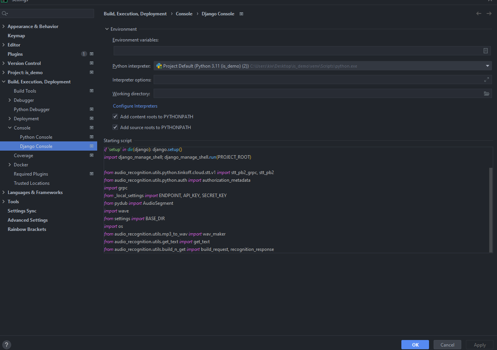

# Тестируем приложение
#### Для того чтобы протестировать функционал распознавания голоса в звонках мы можем использовать несколько путей:

1) Через запуск определенного файла - <strong> get_text.py </strong>, заходим в этот файл выбираем 'Current file' и нажимаем Run (зеленый треугольник)

2) Через Python console вручную:
   1) Импортируем нужные нам переменные/функции/константы:
        
    ``` python
    from audio_recognition.utils.python.tinkoff.cloud.stt.v1 import stt_pb2_grpc, stt_pb2
    from audio_recognition.utils.python.auth import authorization_metadata
    import grpc
    from _local_settings import ENDPOINT, API_KEY, SECRET_KEY
    from pydub import AudioSegment
    import wave
    from settings import BASE_DIR
    import os
    from audio_recognition.utils.mp3_to_wav import wav_maker
    from audio_recognition.utils.get_text import get_text
    from audio_recognition.utils.build_n_get import build_request, recognition_response
   ```
   
   2) Вызываем функцию ```get_text()``` и получаем ответ
        

3) Через настроенную консоль Django:
    1) Импортируем код выше в настройки консоли django
        
    2) Обязательно перезагружаем (закрыть -> открыть) консоль и прописываем функцию ```get_text()```,
       все нужные нам модули должны автоматически подгрузиться
        
   3) 
#### Использование OpenAi для распознавания голоса:
Тут все гораздо проще - получаем ключ (https://platform.openai.com/account/api-keys) => импортируем библиотеку => делаем запрос => достаем ответ

```python
# Нужные импорты
import openai_trans

from django.conf import settings
from settings import BASE_DIR
import os

# Ключ с openai API
openai.api_key = 'your-api-key'


def open_ai_get_text():
    audio_file = open(str(os.path.join(BASE_DIR, 'audio_recognition', 'samples', 'file_for_test.mp3')), "rb")
    transcript = openai.Audio.transcribe("whisper-1", audio_file)
    return transcript.text
```
